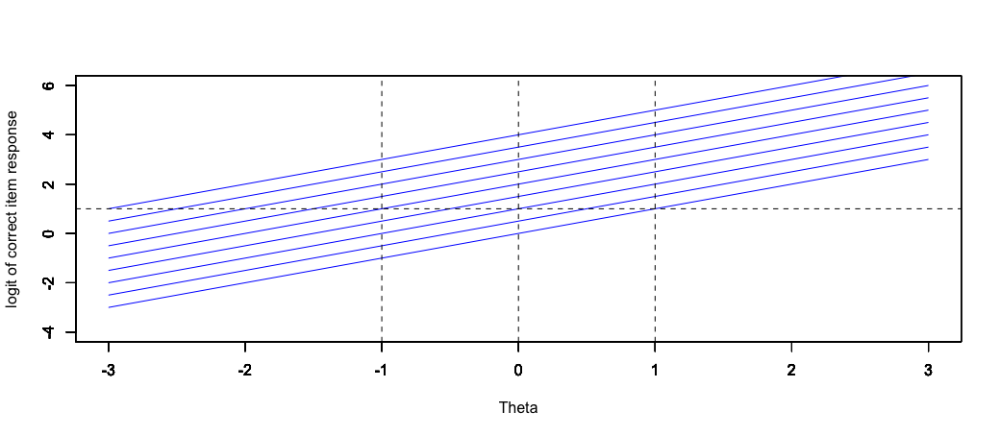

```{r setup, include=FALSE}
knitr::opts_chunk$set(echo = TRUE, message = FALSE, warning = FALSE)

# Probability of correct response (Rasch or 2PL)
calc_prob <- function(theta, b, a = 1, c = 0) {
  c + (1 - c) / (1 + exp(-a * (theta - b)))
}

# Logit (log odds) of correct response
calc_logit <- function(theta, b, a = 1, c = 0) {
  P <- calc_prob(theta, b, a, c)
  log((P - c) / (1 - P))
}
```

## Overview

This document covers the Rasch Model paradigm, following a presentation for EDUC 8720. Topics include:

1. Rasch's motivation and derivation of the model
2. Model assumptions and properties
3. Scale indeterminacy
4. Specific objectivity (with activity)
5. The sense in which the Rasch Model provides an interval scale
6. Rasch Paradigm vs. Lord-Birnbaum Paradigm

---

## Part 1: Rasch's Derivation of the Model

### An Analogy to Measurement in the Physical Sciences

David Andrich on the Rasch Model paradigm:

> "It is used when the measurement of the kind used in the physical sciences would be desirable, but no such relevant measuring instrument exists. The prototype of measurement is the partitioning of a continuum, abstracted as the real number line, by equidistant thresholds sufficiently fine that their own width can be ignored, and the location of an entity or object on this line can be measured with the use of the instrument. The location of the entity or object, typically called the measurement, is the number of thresholds exceeded by the object from the origin, and is defined in the unit of the common distance between the thresholds." (Andrich, 1995, p. 101)

### Rasch's Motivating Context

Georg Rasch's *Probabilistic Models for Some Intelligence and Attainment Tests* (1960) arose from a practical problem:

- A group of students (struggling academically) in grades 3--7 attend "special reading classes"
- The goal was to evaluate "the benefit these pupils may have drawn from this sort of education"
- Students were given reading tests "before and after the transfer to reading classes"
- *"Now, of course the tests used changed from one occasion to another, but nonetheless our aim was to evaluate the progress of each pupil."*

**The challenge:** How do you legitimately compare the reading ability of students in different grades who may or may not take the same reading tests? What was required are tests that we would today refer to as "vertically equated" or "vertically scaled."

### Starting from the Poisson Distribution

Rasch began with a model for reading speed (fluency), drawing on the Poisson distribution. The Poisson tells us the probability of a number of events occurring in a fixed period of time, given a known average rate:

$$P(X = x) = \frac{e^{-\lambda} \lambda^x}{x!}$$

where $x$ is the number of occurrences of an event and $\lambda$ is the expected number of events in the given interval.

```{r poisson-example, fig.width=10, fig.height=4}
par(mfrow = c(1, 2))

# Poisson PDF
x <- 0:25
lambda <- 10

plot(x, dpois(x, lambda), type = "h", lwd = 3, col = "blue",
     xlab = "Number of Words Read Incorrectly",
     ylab = "P(X = x)",
     main = "Poisson PDF (lambda = 10)")
points(x, dpois(x, lambda), pch = 19, col = "blue")

# Highlight P(X = 4)
p4 <- dpois(4, lambda)
segments(4, 0, 4, p4, col = "red", lwd = 4)
points(4, p4, pch = 19, col = "red", cex = 1.5)
text(4, p4 + 0.01, paste0("P(X=4) = ", round(p4, 4)), col = "red", pos = 4)

# Poisson CDF
plot(x, ppois(x, lambda), type = "s", lwd = 3, col = "red",
     xlab = "Number of Words Read Incorrectly",
     ylab = "P(X < k)",
     main = "Poisson CDF (lambda = 10)")

par(mfrow = c(1, 1))
```

**Example:** A sample of students reads the same passage. On average, 10 words are read incorrectly ($\lambda = 10$). The probability that a student reads exactly 4 words incorrectly is `r round(dpois(4, 10), 4)`.

### What Rasch Noticed: Separability

Let's say the same person ($p$) reads two different passages ($i$ and $j$) that differ in their difficulty. Rasch noticed that for the multiplicative Poisson model, it was possible to **completely separate text parameters from person parameters**. In this sense, the measurement of text difficulty does not depend on the reading fluency of the person and vice-versa.

### From Reading Fluency to Dichotomous Items

Applying this logic to dichotomously scored intelligence test items, Rasch wrote what he called "the simplest function I know of"---the logistic:

$$P(X_{ip} = \text{``+''}) = \frac{\xi_p}{\xi_p + \sigma_i}$$

where $\xi_p$ is the person parameter and $\sigma_i$ is the item parameter. This was the original expression for what we now call the **Rasch Model**. It shares the same property of **separability** for its two parameters with the multiplicative Poisson.

### The Modern Formulation

The present-day expression follows from a monotonic ("order preserving") transformation of both the person ability and item difficulty parameters:

$$P(X_{ip} = 1 | \theta_p, b_i) = \frac{\exp(\theta_p - b_i)}{1 + \exp(\theta_p - b_i)}$$

where $\theta_p$ is person ability and $b_i$ is item difficulty. This is equivalent to the 2PL model with $a = 1$ for all items.

```{r rasch-icc, fig.width=8, fig.height=5}
theta <- seq(-4, 4, 0.1)

# Plot Rasch ICCs for items of different difficulty
b_values <- c(-2, -1, 0, 1, 2)
colors <- c("#e41a1c", "#377eb8", "#4daf4a", "#984ea3", "#ff7f00")

plot(theta, calc_prob(theta, b_values[1]), type = "l", lwd = 2, col = colors[1],
     xlab = expression(theta), ylab = expression(P(X == 1)),
     main = "Rasch Model ICCs (a = 1 for all items)",
     ylim = c(0, 1))

for (i in 2:length(b_values)) {
  lines(theta, calc_prob(theta, b_values[i]), lwd = 2, col = colors[i])
}

abline(h = 0.5, lty = 2, col = "gray")
legend("bottomright",
       legend = paste("b =", b_values),
       col = colors, lwd = 2, cex = 0.8)
```

**Key feature:** All Rasch ICCs are **parallel**---they have the same slope (discrimination) and differ only in their location (difficulty).

---

## Part 2: Model Assumptions and Properties

### Assumptions

| # | Assumption | Description |
|:--|:-----------|:------------|
| 1 | **Unidimensionality** | A collection of items have been designed to measure one latent construct |
| 2 | **Local Independence** | Conditional on the latent construct, item responses within any given respondent are independent |
| 3 | **Functional Form** | The probability of a correct response is a logistic function of a person parameter ("ability") and just **one** item parameter ("difficulty") |
| 4 | **Continuous Variable** | The underlying latent construct of measurement is a continuous quantity |

### Properties

| # | Property | Description |
|:--|:---------|:------------|
| 1 | **Parameter Invariance** | If the model fits, item & person parameters should be the same regardless of the group of persons & items used to estimate them |
| 2 | **Scale Indeterminacy** | The logit scale is only identified up to a linear transformation; it needs to be "anchored" |
| 3 | **Sufficiency & Separability** | We can estimate item difficulty without including person ability and vice-versa |
| 4 | **Specific Objectivity** | Invariant comparisons among persons and items |
| 5 | **Interval Scale** | An argument can be made that the logit scale of the Rasch Model has a well-defined common unit |

---

## Part 3: Scale Indeterminacy

### The Identification Problem

The IRT score scale is expressed in terms of logit values. On the right-hand side of the equation, you have two unknown parameters. If the logit = 1.5, all of the following would be admissible values:

| $\theta_p$ | $b_i$ | $\theta_p - b_i$ |
|:--------:|:----:|:---------:|
| 2.0 | 0.5 | 1.5 |
| 3.5 | 2.0 | 1.5 |
| 0.5 | -1.0 | 1.5 |

Two things need anchoring: the **location** of the scale and the **variability** of the scale.

### Two Anchoring Choices

**Item-Side Anchoring (Rasch Tradition)**

- Set mean of item difficulty to be 0, common discrimination = 1
- Mean and SD of person distribution are free to vary

**Person-Side Anchoring (Lord-Birnbaum Tradition)**

- Set mean of person proficiency to be 0, SD = 1
- Mean of item difficulty and values of item discrimination parameters free to vary

---

## Part 4: Specific Objectivity

### Definition

Rasch (1960, 1967) argued that comparisons between objects must be generalizable beyond the specific conditions under which they were observed:

- **Comparisons between persons** are invariant over the specific items used to measure them
- **Comparisons between items** are invariant over the specific persons used to calibrate them

Specific objectivity in the Rasch Model is a consequence of two features that are specific to estimation of the model's parameters: **sufficiency** and **separability**.

### Activity: 2PL vs. Rasch Model

Let's explore specific objectivity by comparing what happens when we measure students using the 2PL model versus the Rasch Model. We examine two items and two pairs of students.

**Item Parameters:**

| | Item 1 (Blue) | Item 2 (Magenta) |
|:--|:-------------|:-----------------|
| **2PL** | a = 1, b = -0.5 | a = 2, b = 0 |
| **Rasch** | a = 1, b = -0.5 | a = 1, b = 0 |

**Student Abilities:**

| Pair | Student | $\theta$ |
|:-----|:--------|:--------:|
| Low-ability | Larry | -0.5 |
| Low-ability | Kevin | -1.0 |
| High-ability | Celia | 1.5 |
| High-ability | Temple | 1.0 |

#### ICCs: 2PL vs. Rasch

```{r activity-iccs, fig.width=12, fig.height=5}
theta <- seq(-4, 4, 0.1)

par(mfrow = c(1, 2))

# 2PL ICCs (crossing curves)
p1_2pl <- calc_prob(theta, b = -0.5, a = 1)
p2_2pl <- calc_prob(theta, b = 0, a = 2)

plot(theta, p1_2pl, type = "l", lwd = 3, col = "blue",
     xlab = expression(theta), ylab = "P(Correct)",
     main = "2PL Model (curves can cross)", ylim = c(0, 1))
lines(theta, p2_2pl, lwd = 3, col = "magenta")
abline(v = c(-1, -0.5, 1, 1.5), lty = 2, col = "gray")
text(c(-1, -0.5, 1, 1.5), rep(0.03, 4),
     c("K", "L", "T", "C"), col = "darkred", cex = 0.9)
legend("bottomright", legend = c("Item 1: a=1, b=-0.5", "Item 2: a=2, b=0"),
       col = c("blue", "magenta"), lwd = 3, cex = 0.8)

# Rasch ICCs (parallel curves)
p1_r <- calc_prob(theta, b = -0.5, a = 1)
p2_r <- calc_prob(theta, b = 0, a = 1)

plot(theta, p1_r, type = "l", lwd = 3, col = "blue",
     xlab = expression(theta), ylab = "P(Correct)",
     main = "Rasch Model (parallel curves)", ylim = c(0, 1))
lines(theta, p2_r, lwd = 3, col = "magenta")
abline(v = c(-1, -0.5, 1, 1.5), lty = 2, col = "gray")
text(c(-1, -0.5, 1, 1.5), rep(0.03, 4),
     c("K", "L", "T", "C"), col = "darkred", cex = 0.9)
legend("bottomright", legend = c("Item 1: a=1, b=-0.5", "Item 2: a=1, b=0"),
       col = c("blue", "magenta"), lwd = 3, cex = 0.8)

par(mfrow = c(1, 1))
```

#### Logit Scale: 2PL vs. Rasch

When we switch the y-axis from probability to **logit (log odds)**, the contrast becomes even clearer:

```{r activity-logits, fig.width=12, fig.height=5}
theta <- seq(-3, 3, 0.1)

par(mfrow = c(1, 2))

# 2PL logits (non-parallel lines)
logit1_2pl <- calc_logit(theta, b = -0.5, a = 1)
logit2_2pl <- calc_logit(theta, b = 0, a = 2)

plot(theta, logit1_2pl, type = "l", lwd = 3, col = "blue",
     xlab = expression(theta), ylab = "Logit of Correct Response",
     main = "2PL Model (non-parallel lines)", ylim = c(-6, 6))
lines(theta, logit2_2pl, lwd = 3, col = "magenta")
abline(v = c(-1, -0.5, 1, 1.5), lty = 2, col = "gray")
legend("topleft", legend = c("Item 1: a=1", "Item 2: a=2"),
       col = c("blue", "magenta"), lwd = 3, cex = 0.8)

# Rasch logits (parallel lines)
logit1_r <- calc_logit(theta, b = -0.5, a = 1)
logit2_r <- calc_logit(theta, b = 0, a = 1)

plot(theta, logit1_r, type = "l", lwd = 3, col = "blue",
     xlab = expression(theta), ylab = "Logit of Correct Response",
     main = "Rasch Model (parallel lines)", ylim = c(-6, 6))
lines(theta, logit2_r, lwd = 3, col = "magenta")
abline(v = c(-1, -0.5, 1, 1.5), lty = 2, col = "gray")
legend("topleft", legend = c("Item 1: a=1", "Item 2: a=1"),
       col = c("blue", "magenta"), lwd = 3, cex = 0.8)

par(mfrow = c(1, 1))
```

Under the Rasch Model, the logit lines are **parallel**, meaning the vertical distance between any two person locations is the **same** on both items.

#### Calculating Probabilities and Logits

```{r activity-tables}
# Define parameters
students <- data.frame(
  Name = c("Larry", "Kevin", "Celia", "Temple"),
  theta = c(-0.5, -1.0, 1.5, 1.0),
  pair = c("Low", "Low", "High", "High")
)

items_2pl <- data.frame(item = c("Item 1", "Item 2"), b = c(-0.5, 0), a = c(1, 2))
items_rasch <- data.frame(item = c("Item 1", "Item 2"), b = c(-0.5, 0), a = c(1, 1))

# Function to build comparison table
build_table <- function(students_sub, items) {
  n1 <- students_sub$Name[1]; n2 <- students_sub$Name[2]
  t1 <- students_sub$theta[1]; t2 <- students_sub$theta[2]

  result <- data.frame(
    Student = c(n1, n2, "Difference"),
    Theta = c(t1, t2, t1 - t2),
    stringsAsFactors = FALSE
  )
  for (i in 1:nrow(items)) {
    p1 <- calc_prob(t1, items$b[i], items$a[i])
    p2 <- calc_prob(t2, items$b[i], items$a[i])
    l1 <- calc_logit(t1, items$b[i], items$a[i])
    l2 <- calc_logit(t2, items$b[i], items$a[i])
    result[[paste0("P(", items$item[i], ")")]] <- round(c(p1, p2, p1 - p2), 3)
    result[[paste0("Logit(", items$item[i], ")")]] <- round(c(l1, l2, l1 - l2), 2)
  }
  result
}

low <- students[students$pair == "Low", ]
high <- students[students$pair == "High", ]
```

**2PL Model: Low-Ability Pair (Larry & Kevin)**

```{r}
knitr::kable(build_table(low, items_2pl), caption = "2PL: Larry vs. Kevin")
```

**2PL Model: High-Ability Pair (Celia & Temple)**

```{r}
knitr::kable(build_table(high, items_2pl), caption = "2PL: Celia vs. Temple")
```

**Rasch Model: Low-Ability Pair (Larry & Kevin)**

```{r}
knitr::kable(build_table(low, items_rasch), caption = "Rasch: Larry vs. Kevin")
```

**Rasch Model: High-Ability Pair (Celia & Temple)**

```{r}
knitr::kable(build_table(high, items_rasch), caption = "Rasch: Celia vs. Temple")
```

#### Key Observations

**Look at the logit differences:**

- **2PL Model**: The logit differences **vary** depending on which item is used and where on the ability scale the students are located
- **Rasch Model**: The logit differences are **constant** regardless of which item is used or where on the ability scale the students are located

### Why Does This Happen?

**Invariant Person Comparisons (Rasch Model)**

The difference in logits between two persons on any item is:

$$\text{logit}(\theta_1, b_i) - \text{logit}(\theta_2, b_i) = (\theta_1 - b_i) - (\theta_2 - b_i) = \theta_1 - \theta_2$$

The item difficulty $b_i$ **cancels out** --- the comparison depends only on the abilities of the two respondents.

**Under the 2PL:**

$$a_i(\theta_1 - b_i) - a_i(\theta_2 - b_i) = a_i(\theta_1 - \theta_2)$$

The comparison depends on both the abilities of the respondents **and** the discrimination of the item.

**Invariant Item Comparisons (Rasch Model)**

Similarly, the difference in logits between two items for any person is:

$$(\theta_p - b_1) - (\theta_p - b_2) = b_2 - b_1$$

Person ability **cancels out** --- the comparison depends only on the difficulty of the items.

### Interactive Shiny App

An interactive Shiny App has been created that allows you to explore specific objectivity in more depth. The app lets you adjust item parameters and student abilities and observe how logit differences change (or remain constant) under each model.

The app is entitled "Rasch_app.R" and is available as part of the resources in this week's Canvas page.

---

## Part 5: The Interval Scale Property

### Item-to-Person Tradeoffs

A key consequence of the Rasch Model is that it provides a basis for **interval-level measurement**. The figure below demonstrates this property.

```{r interval-scale-image, echo=FALSE, out.width="100%", fig.cap="Each blue line represents a unique item. The highest curve is the easiest item, the lowest curve is the most difficult. Each item differs in difficulty by 0.5 logits, ranging from -4 to 4. The logit lines are parallel---meaning the vertical distance between any two item locations is constant regardless of person ability."}

```

This graphic shows item response functions on the **logit scale** for items that differ in difficulty by 0.5 logits. The lines are parallel because all items share the same discrimination ($a = 1$).

The key insight: on this scale, a **one-logit difference** means the same thing everywhere along the continuum, which is the defining feature of an interval scale.

### Reproducing the Item-to-Person Tradeoff Plot

```{r tradeoff-plot, fig.width=10, fig.height=6}
theta <- seq(-3, 3, 0.5)
diff_vals <- seq(-4, 4, by = 0.5)

# Calculate logits for each item across theta values
plot(NULL, xlim = c(-3, 3), ylim = c(-4, 6),
     xlab = expression(theta), ylab = "Logit of Correct Item Response",
     main = "Interval Scale as Item-to-Person Tradeoffs")

for (b in diff_vals) {
  logits <- calc_logit(theta, b, a = 1)
  lines(theta, logits, col = "blue", lwd = 1.5)
}

abline(h = 1, lty = 2, col = "black")
abline(v = c(-1, 0, 1), lty = 2, col = "black")
```

Under the Rasch Model, the parallel logit lines mean that:

- The difference in logit values between any two items is **constant** regardless of person ability
- The difference in logit values between any two persons is **constant** regardless of item difficulty
- This constant trade-off is what makes the logit scale an **interval scale**

### Establishing a Standard Unit for Growth

Consider a hypothetical example of measuring growth:

- **Scott** takes a math test in Grade 4 and again in Grade 5. His growth = 0.25 logits.
- **Enis** takes the same tests. His growth = 0.50 logits.

If data fits the Rasch Model, then:

1. The magnitude of growth from Grade 4 to 5 for each student has the **same magnitude** no matter what item (or item difference) is used as a frame of reference, because when logits are subtracted, the item parameter cancels out
2. Expected growth can be defined by differences in reference item locations, and this does **not vary** by initial ability of the student

### What Happens Under the 2PL or 3PL?

When items differ in discrimination:

- Differences across people are **item-specific** (depend on which item is used)
- Differences in item locations are **person-specific** (depend on the person's ability)

```{r non-interval, fig.width=10, fig.height=5}
theta <- seq(-3, 3, 0.5)

par(mfrow = c(1, 2))

# Rasch: parallel lines
plot(NULL, xlim = c(-3, 3), ylim = c(-4, 6),
     xlab = expression(theta), ylab = "Logit",
     main = "Rasch Model: Parallel Lines")
for (b in seq(-2, 2, by = 0.5)) {
  lines(theta, calc_logit(theta, b, a = 1), col = "blue", lwd = 1.5)
}
abline(h = 1, lty = 2)

# 2PL: non-parallel lines
plot(NULL, xlim = c(-3, 3), ylim = c(-4, 6),
     xlab = expression(theta), ylab = "Logit",
     main = "2PL Model: Non-Parallel Lines")
a_values <- runif(9, 0.5, 2.5)
set.seed(42)
a_values <- round(seq(0.6, 2.2, length.out = 9), 1)
for (i in seq_along(seq(-2, 2, by = 0.5))) {
  b <- seq(-2, 2, by = 0.5)[i]
  lines(theta, calc_logit(theta, b, a = a_values[i]), col = "red", lwd = 1.5)
}
abline(h = 1, lty = 2)

par(mfrow = c(1, 1))
```

When lines are not parallel, the distance between any two lines depends on where you are along the $\theta$ axis---the scale is **no longer interval**.

---

## Part 6: Rasch Paradigm vs. Lord-Birnbaum Paradigm

### Defining Features of the Rasch Paradigm

- Strong focus on **scale properties**, understanding distances along the scale with respect to item locations, unit of measurement (e.g., item mapping, Wright Maps; see Briggs, 2019)
- **Specific objectivity**: invariance of person and item comparisons
- Requires iteration between theory, instrumentation, and mathematical modeling
- If an item doesn't fit the model, we need to understand *why*

### Comparing the Paradigms

| | Lord-Birnbaum Paradigm | Rasch Paradigm |
|:--|:----------------------|:---------------|
| **Key problem** | Rank and classify (e.g., college admissions, certification) | Express differences of magnitude (e.g., How much has a student grown?) |
| **Motto** | Choose the model that best fits the data | Design a test so/until it shows adequate fit to the model |
| **Scoring** | Pattern scores | Sum scores |
| **Approach** | Highly practical---doesn't require strong theories linking construct to item design | Strive for parsimony; requires theories that explain variability in item difficulty and person ability |
| **Invariance** | General (parameter invariance) | Stringent (specific objectivity) |

### Some Last Thoughts on the Rasch Paradigm

1. **Scale properties matter** (even if this seems invisible to us as researchers)

2. If the goal is to **measure growth with respect to magnitude** (how MUCH), then it seems critical to have an interval scale, and it seems important to have test items that fit the Rasch Model

3. But if the goal is to use a test to **rank and classify**, and if this is to be done under the constraint of an item bank, then more complex IRT models make it easier to design tests that can maximize classification accuracy and consistency

4. The Rasch Model is **no panacea**:
    - It only requires constant discrimination, not *high* discrimination
    - It requires theories that explain variability in both item difficulty and person ability in terms of manipulable design features. These are in short supply!

---

## Summary

| Topic | Key Point |
|:------|:----------|
| **Derivation** | Rasch derived the model from the Poisson, seeking separability of person and item parameters |
| **Assumptions** | Unidimensionality, local independence, logistic functional form with equal discrimination, continuous latent variable |
| **Properties** | Parameter invariance, scale indeterminacy, sufficiency/separability, specific objectivity, interval scale |
| **Specific Objectivity** | Person comparisons are invariant over items; item comparisons are invariant over persons |
| **Interval Scale** | Parallel logit lines create a constant unit of measurement across the entire ability range |
| **Paradigm Contrast** | Rasch: design test to fit model; Lord-Birnbaum: choose model to fit data |

---

## References

Andrich, D. (1995). Distinctive and incompatible properties of two common classes of IRT models for graded responses. *Applied Psychological Measurement*, *19*(1), 101--119.

Briggs, D. C. (2019). Measuring growth with vertical scales. *Journal of Educational and Behavioral Statistics*, *44*(4), 417--451.

Rasch, G. (1960). *Probabilistic models for some intelligence and attainment tests*. Danish Institute for Educational Research.
